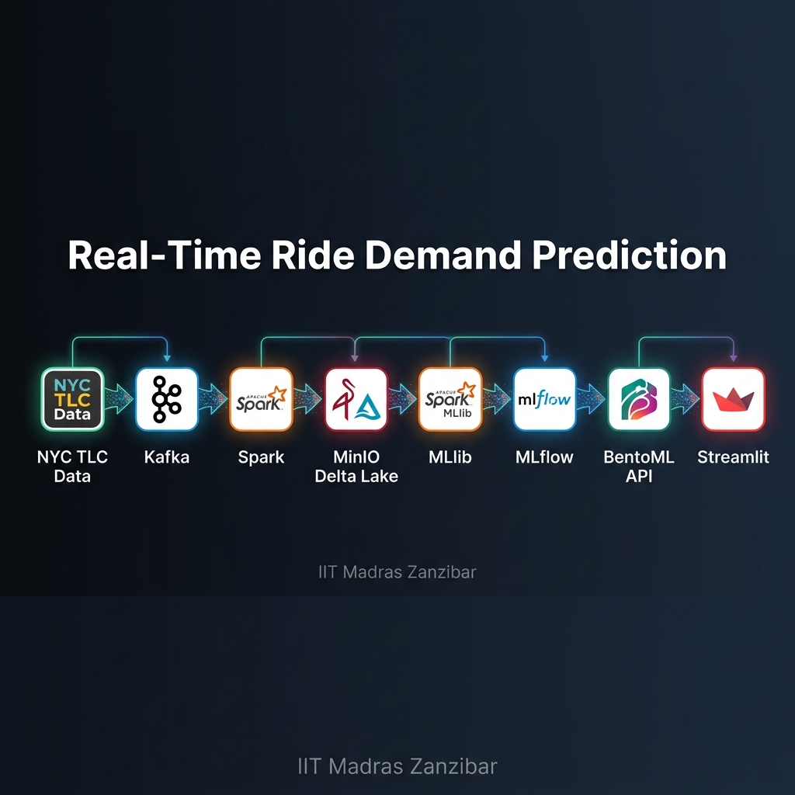
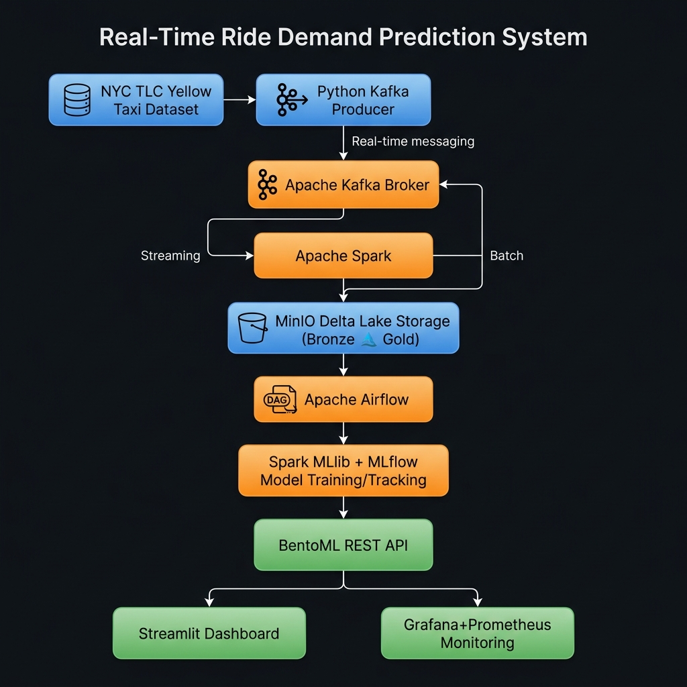
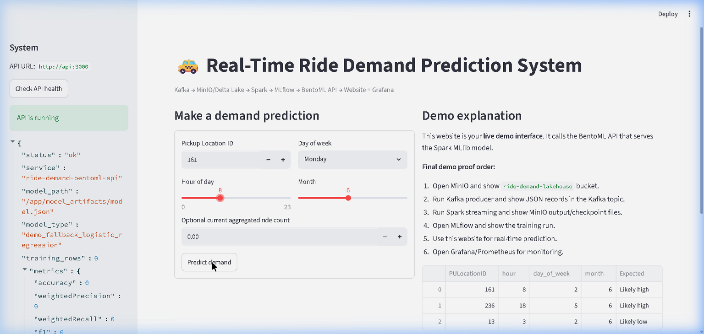
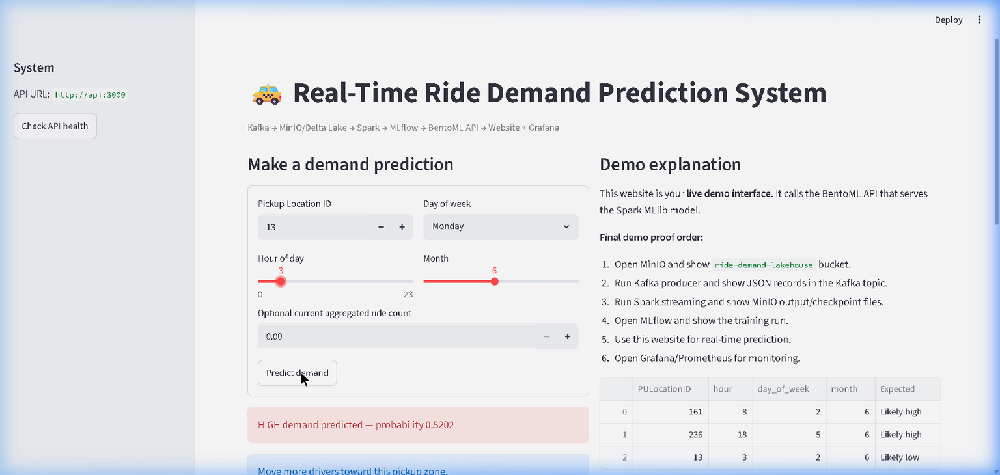

<div align="center">



<br/><br/>

# 🏛️ Indian Institute of Technology Madras Zanzibar
### School of Science and Engineering &nbsp;|&nbsp; Z5008: Big Data Lab
### M.Tech Data Science & Artificial Intelligence · 2026

<br/>

<p>
  
  
  
  
  
  
  
  
  
  
</p>

<br/>

<h2>🚕 Real-Time Ride Demand Prediction System</h2>

<p><strong>An end-to-end Big Data + MLOps pipeline that classifies NYC taxi ride demand (<code>HIGH</code> / <code>LOW</code>) in real time.<br/>
Kafka → Spark Streaming → MinIO / Delta Lake → Spark MLlib → MLflow → BentoML → Streamlit → Grafana</strong></p>

</div>

---

## 📋 Project Information

| Field | Details |
|---|---|
| **Course** | Z5008: Big Data Lab |
| **Program** | M.Tech Data Science & Artificial Intelligence |
| **Institution** | IIT Madras Zanzibar |
| **Instructor** | Dr. Innocent Nyalala |
| **Repository** | [github.com/zda25m006-ship-it/big-data-project](https://github.com/zda25m006-ship-it/big-data-project) |

---

## 👥 Team

| Name | Roll Number | Email | Role |
|---|---|---|---|
| **Surabhi Gudla** | ZDA25M001 | zda25m001@iitmz.ac.in | Big Data Lead — Kafka, MinIO, Spark Streaming & Batch, Airflow |
| **Krishna Ryali** | ZDA25M006 | zda25m006@iitmz.ac.in | ML & Deployment Lead — Spark MLlib, MLflow, BentoML, Grafana |

**Shared Responsibilities:** System integration, evaluation metrics, report writing, debugging, and presentation.

---

## 📑 Table of Contents

1. [Problem Statement](#-problem-statement)
2. [Dataset](#-dataset)
3. [System Architecture](#-system-architecture)
4. [Technology Stack](#-technology-stack)
5. [Repository Structure](#-repository-structure)
6. [Quick Start](#-quick-start)
7. [Full Pipeline Setup](#-full-pipeline-setup)
8. [Model & Evaluation](#-model--evaluation)
9. [Novelty](#-novelty)
10. [Demo Video](#-demo-video)
11. [License](#-license)

---

## 🎯 Problem Statement

Urban ride demand fluctuates significantly across locations and times of day, causing **long passenger wait times** in high-demand zones and **idle drivers** in low-demand zones.

This project builds a **Real-Time Ride Demand Prediction System** that processes streaming ride events and classifies demand as **HIGH** or **LOW** per pickup location — enabling proactive driver dispatch.

### Label Engineering

Since NYC TLC data contains no explicit demand labels, we engineer them via aggregation:

1. Compute **ride count** per `(PULocationID, hour, day_of_week, month)`.
2. Calculate each location's **average ride count** as an adaptive threshold.
3. Assign binary labels:

```
HIGH  →  ride_count > location_avg_threshold
LOW   →  ride_count ≤ location_avg_threshold
```

> **Key insight:** Location-adaptive thresholds mean demand classification is calibrated to each zone — a busy Manhattan block and a quiet suburb each have *their own* HIGH/LOW boundary.

### Stakeholder Impact

| Stakeholder | Benefit |
|---|---|
| **Ride-sharing companies** | Reduce idle time, optimize fleet allocation |
| **Drivers** | Position in high-demand zones to maximize earnings |
| **Passengers** | Shorter wait times via proactive dispatch |

---

## 📊 Dataset

### Source

**New York City Taxi and Limousine Commission (TLC) — Yellow Taxi Trip Records**

> 🔗 **Official Dataset Portal:** **[https://www.nyc.gov/site/tlc/about/tlc-trip-record-data.page](https://www.nyc.gov/site/tlc/about/tlc-trip-record-data.page)**

The NYC TLC dataset is one of the largest publicly available urban mobility datasets in the world, covering over a decade of yellow cab trips across New York City.

| Property | Value |
|---|---|
| **Format** | Parquet (columnar, compressed) |
| **Size per month** | ~150–300 MB |
| **Records per month** | ~3–5 million rows |
| **Total (multi-year)** | 10M+ rows available |
| **Years available** | 2009 – 2026 |
| **License** | Public domain — NYC Open Data |

### Features Used

| Column | Type | Description |
|---|---|---|
| `tpep_pickup_datetime` | Timestamp | Date/time when the taximeter was engaged |
| `PULocationID` | Integer (1–263) | TLC Taxi Zone where trip started |
| `DOLocationID` | Integer (1–263) | TLC Taxi Zone where trip ended |
| `trip_distance` | Float | Elapsed trip distance in miles |
| `fare_amount` | Float | Time-and-distance fare calculated by meter |
| `passenger_count` | Integer | Number of passengers in vehicle |

### Engineered Features (fed to ML model)

| Feature | Description |
|---|---|
| `PULocationID` | Pickup zone identifier (1–263) |
| `hour` | Hour extracted from pickup datetime (0–23) |
| `day_of_week` | Day of week (1=Sunday … 7=Saturday, Spark convention) |
| `month` | Month of trip (1–12) |
| `is_weekend` | Binary flag: 1 if Saturday/Sunday |

### Download Data

```bash
# Download January 2024 Parquet (~200 MB)
mkdir -p data/raw/nyc_tlc
curl -L -o data/raw/nyc_tlc/yellow_tripdata_2024-01.parquet \
  https://d37ci6vzurychx.cloudfront.net/trip-data/yellow_tripdata_2024-01.parquet
```

> A pre-generated 5,000-row demo CSV is already included in `data/sample/yellow_taxi_sample.csv` for quick testing without downloading the full dataset.

---

## 🏗️ System Architecture



The system implements an **8-layer, end-to-end real-time data pipeline**:

```
┌──────────────────────────────────────────────────────────────┐
│              NYC TLC Yellow Taxi Dataset                      │
│        (Parquet / CSV — 3–5M records per month)              │
│  🔗 https://www.nyc.gov/site/tlc/about/tlc-trip-record-data  │
└───────────────────────────┬──────────────────────────────────┘
                            │
                   [1] DATA INGESTION
                            │
                ┌───────────▼───────────┐
                │   Python Kafka        │
                │   Producer            │
                │  (kafka_producer.py)  │
                │  1–10 records/sec     │
                └───────────┬───────────┘
                            │
                   [2] MESSAGE STREAMING
                            │
                ┌───────────▼───────────┐
                │    Apache Kafka       │
                │  Topic: ride_events   │
                │  Broker: port 9092    │
                └─────┬──────────┬──────┘
                      │          │
           [3a] STREAMING    [3b] BATCH
           PROCESSING        PROCESSING
                │                 │
   ┌────────────▼──┐   ┌──────────▼──────────┐
   │ Spark          │   │  Spark Batch         │
   │ Structured     │   │  Feature Engineering │
   │ Streaming      │   │  (batch_feature_     │
   │                │   │   engineering.py)    │
   └────────────┬───┘   └──────────┬──────────┘
                │                  │
                └──────┬───────────┘
                       │
                  [4] STORAGE
                       │
          ┌────────────▼────────────┐
          │   MinIO Object Storage  │
          │   + Delta Lake Tables   │
          │  Bronze/ → Gold/delta/  │
          │  ride-demand-lakehouse  │
          └────────────┬────────────┘
                       │
            [5] ORCHESTRATION
                       │
          ┌────────────▼────────────┐
          │   Apache Airflow DAG    │
          │   (ride_demand_dag.py)  │
          │   Schedule: @daily      │
          └────────────┬────────────┘
                       │
              [6] MODEL TRAINING
                       │
          ┌────────────▼────────────┐
          │  Spark MLlib            │
          │  Logistic Regression /  │
          │  Random Forest          │
          │  (train_spark_mllib.py) │
          └────────────┬────────────┘
                       │
           [7] EXPERIMENT TRACKING
                       │
          ┌────────────▼────────────┐
          │        MLflow           │
          │  Params + Metrics +     │
          │  Artifact Registry      │
          └────────────┬────────────┘
                       │
              [8] MODEL SERVING
                       │
          ┌────────────▼────────────┐
          │      BentoML API        │
          │   REST /predict         │
          │   /health endpoints     │
          │   Port: 3000            │
          └────────┬────────────────┘
                   │
        ┌──────────┴──────────┐
        │                     │
┌───────▼──────┐    ┌─────────▼──────────┐
│  Streamlit   │    │ Prometheus + Grafana│
│  Dashboard   │    │ Monitoring &        │
│  Port: 8501  │    │ Dashboards :3001    │
└──────────────┘    └────────────────────┘
```

---

## 🛠️ Technology Stack

| Layer | Tool | Version | Purpose |
|---|---|---|---|
| **Ingestion** | Apache Kafka | 7.6.1 (Confluent) | Real-time event streaming, decoupled ingestion |
| **Storage** | MinIO + Delta Lake | RELEASE.2024-07-16 | S3-compatible lakehouse with ACID guarantees |
| **Processing** | Apache Spark | 3.5.1 | Distributed batch & structured streaming at scale |
| **Orchestration** | Apache Airflow | 2.9.3 | Automated daily pipeline scheduling |
| **ML Model** | Spark MLlib | 3.5.1 | Scalable logistic regression on millions of records |
| **Experiment Tracking** | MLflow | 2.14.3 | Tracks params, metrics, and model versions |
| **Model Serving** | BentoML | Latest | Production-ready ML REST API deployment |
| **Web Interface** | Streamlit | Latest | Interactive real-time prediction dashboard |
| **Monitoring** | Grafana + Prometheus | 11.1.0 / 2.53.0 | Metrics visualization and alerting |
| **Infrastructure** | Docker + Compose | Latest | Reproducible containerized environment |
| **Backend DB** | PostgreSQL | 15 | MLflow backend metadata store |

---

## 📁 Repository Structure

```
big-data-project/
│
├── api/                            # BentoML REST API
│   ├── service.py                  # /predict and /health endpoints
│   ├── model_artifacts/
│   │   └── model.json              # Trained LR model (JSON export)
│   ├── Dockerfile
│   ├── bentofile.yaml
│   └── requirements.txt
│
├── website/                        # Streamlit prediction UI
│   ├── app.py                      # Interactive demand prediction app
│   ├── Dockerfile
│   └── requirements.txt
│
├── producer/                       # Kafka data producer
│   ├── kafka_producer.py           # Streams NYC TLC rows into Kafka
│   ├── Dockerfile
│   └── requirements.txt
│
├── spark_jobs/                     # Apache Spark jobs
│   ├── streaming_aggregation.py    # Kafka → MinIO Delta/Parquet streaming
│   └── batch_feature_engineering.py# Historical feature table creation
│
├── ml/                             # Machine learning pipeline
│   ├── train_spark_mllib.py        # Logistic Regression + Random Forest
│   └── artifacts/                  # Saved metrics JSON output
│
├── dags/                           # Apache Airflow DAGs
│   └── ride_demand_dag.py          # Daily orchestration pipeline
│
├── grafana/                        # Monitoring configuration
│   └── provisioning/
│       ├── dashboards/             # Auto-provisioned dashboards
│       └── datasources/            # Prometheus data source config
│
├── prometheus/
│   └── prometheus.yml              # Metrics scraping config
│
├── data/
│   └── sample/
│       ├── generate_sample.py      # Synthetic sample generator
│       └── yellow_taxi_sample.csv  # 5,000-row demo CSV
│
├── common/
│   ├── __init__.py
│   └── demand_utils.py             # Shared utility functions
│
├── scripts/
│   ├── load_test_api.py            # 10× load test for API
│   ├── upload_to_minio.sh          # Upload raw data to MinIO bronze
│   └── check_minio_streaming.sh    # Verify streaming output in MinIO
│
├── docs/
│   ├── DEMO_STEPS.md               # Step-by-step demo guide
│   ├── architecture_diagram.png    # System architecture visual
│   └── project_banner.png          # Project banner
│
├── tests/
│   └── test_demand_utils.py        # Unit tests (pytest)
│
├── notebooks/
│   └── README.md                   # Planned EDA notebooks
│
├── docker-compose.yml              # Full stack: all 10 services
├── .env.example                    # Environment variable template
├── requirements-dev.txt            # Local development dependencies
├── Makefile                        # Convenience commands
├── steps.md                        # Detailed demo execution steps
└── README.md                       # This file
```

---

## 🚀 Quick Start

### Option A — Website + API Only (No Docker required)

```bash
# 1. Clone the repository
git clone https://github.com/zda25m006-ship-it/big-data-project.git
cd big-data-project

# 2. Set up environment
cp .env.example .env
python -m venv .venv
source .venv/bin/activate         # Windows: source .venv/Scripts/activate

# 3. Install dependencies
pip install -r requirements-dev.txt

# 4. Terminal 1 — Start the BentoML API
cd api
bentoml serve service:RideDemandService --host 0.0.0.0 --port 3000

# 5. Terminal 2 — Start the Streamlit Dashboard
cd website
streamlit run app.py
```

| Service | URL |
|---|---|
| 🌐 **Streamlit Dashboard** | http://localhost:8501 |
| 🔌 **BentoML API** | http://localhost:3000 |

---

### Option B — Full Stack with Docker Compose *(Recommended)*

```bash
# 1. Clone and configure
git clone https://github.com/zda25m006-ship-it/big-data-project.git
cd big-data-project
cp .env.example .env

# 2. Launch all 10 services
docker compose up -d --build
```

| Service | URL | Credentials |
|---|---|---|
| 🌐 Streamlit Dashboard | http://localhost:8501 | — |
| 🔌 BentoML API | http://localhost:3000 | — |
| 🗃️ MinIO Console | http://localhost:9001 | `admin` / `bigdata123` |
| 🧪 MLflow | http://localhost:5000 | — |
| 📊 Grafana | http://localhost:3001 | `admin` / `admin` |
| 🌬️ Airflow | http://localhost:8080 | see container logs |
| ⚡ Spark Master UI | http://localhost:8081 | — |
| 📈 Prometheus | http://localhost:9090 | — |

---

## 🔬 Full Pipeline Setup

### Step 1 — Download NYC TLC Data

```bash
mkdir -p data/raw/nyc_tlc
curl -L -o data/raw/nyc_tlc/yellow_tripdata_2024-01.parquet \
  https://d37ci6vzurychx.cloudfront.net/trip-data/yellow_tripdata_2024-01.parquet
```

> Dataset source: [NYC TLC Trip Record Data](https://www.nyc.gov/site/tlc/about/tlc-trip-record-data.page)  
> Or use the included 5,000-row sample: `data/sample/yellow_taxi_sample.csv`

---

### Step 2 — Upload to MinIO (Bronze Layer)

```bash
bash scripts/upload_to_minio.sh
```

Opens MinIO at `ride-demand-lakehouse/bronze/yellow_taxi/`

---

### Step 3 — Spark Batch Feature Engineering (Gold Layer)

```bash
docker compose exec spark-master bash -lc '
export AWS_ACCESS_KEY_ID=admin
export AWS_SECRET_ACCESS_KEY=bigdata123
/opt/spark/bin/spark-submit \
  --master local[2] \
  --packages io.delta:delta-spark_2.12:3.2.0,org.apache.hadoop:hadoop-aws:3.3.4,com.amazonaws:aws-java-sdk-bundle:1.12.262 \
  /opt/project/spark_jobs/batch_feature_engineering.py \
  --input /opt/project/data/raw/nyc_tlc/yellow_tripdata_2024-01.parquet \
  --format parquet \
  --output s3a://ride-demand-lakehouse/delta/gold/ride_demand_features
'
```

---

### Step 4 — Train Spark MLlib Model + Log to MLflow

```bash
export MLFLOW_TRACKING_URI=http://localhost:5000
export AWS_ACCESS_KEY_ID=admin
export AWS_SECRET_ACCESS_KEY=bigdata123

python ml/train_spark_mllib.py \
  --input data/raw/nyc_tlc/yellow_tripdata_2024-01.parquet \
  --format parquet \
  --model-type logistic_regression \
  --model-json-output api/model_artifacts/model.json
```

Restart services after training:

```bash
docker compose up -d --build api website
```

---

### Step 5 — Kafka Streaming Producer

```bash
python producer/kafka_producer.py \
  --input data/raw/nyc_tlc/yellow_tripdata_2024-01.parquet \
  --bootstrap localhost:9092 \
  --topic ride_events \
  --rate 5 \
  --limit 1000
```

---

### Step 6 — Spark Structured Streaming → MinIO Delta Lake

```bash
docker compose exec spark-master bash -lc '
/opt/spark/bin/spark-submit \
  --master local[2] \
  --packages io.delta:delta-spark_2.12:3.2.0,org.apache.hadoop:hadoop-aws:3.3.4,com.amazonaws:aws-java-sdk-bundle:1.12.262,org.apache.spark:spark-sql-kafka-0-10_2.12:3.5.1 \
  /opt/project/spark_jobs/streaming_aggregation.py \
  --bootstrap kafka:29092 \
  --topic ride_events \
  --output s3a://ride-demand-lakehouse/delta/gold/streaming_ride_counts \
  --checkpoint s3a://ride-demand-lakehouse/checkpoints/streaming_ride_counts \
  --output-format delta
'
```

---

### Step 7 — Run Load Test (10× concurrency)

```bash
python scripts/load_test_api.py \
  --url http://localhost:3000/predict \
  --requests 100 \
  --workers 10
```

---

### Step 8 — Unit Tests

```bash
pytest -q
```

---

## 🤖 Model & Evaluation

### Model Details

| Aspect | Details |
|---|---|
| **Task** | Binary classification (`HIGH` / `LOW` demand) |
| **Primary Model** | Logistic Regression (Spark MLlib) |
| **Secondary Model** | Random Forest (80 trees, max depth 8) |
| **Features** | `PULocationID`, `hour`, `day_of_week`, `month`, `is_weekend` |
| **Label** | `1 = HIGH demand`, `0 = LOW demand` |
| **Train/Test Split** | 80% / 20% |
| **Experiment Tracking** | MLflow (params, metrics, model artifacts) |

### API Prediction Example

```bash
curl -X POST http://localhost:3000/predict \
  -H "Content-Type: application/json" \
  -d '{"request": {"PULocationID": 161, "hour": 8, "day_of_week": 2, "month": 6}}'
```

```json
{
  "demand": "HIGH",
  "probability_high": 0.7231,
  "threshold": 0.5,
  "recommendation": "Move more drivers toward this pickup zone."
}
```

### Evaluation Metrics

| Metric | Description |
|---|---|
| **Accuracy** | Overall correctness of predictions |
| **Precision** | Reliability of HIGH demand predictions |
| **Recall** | Ability to correctly identify all HIGH demand instances |
| **F1-Score** | Harmonic mean of precision & recall *(primary metric for imbalanced classes)* |
| **AUC-ROC** | Area under the Receiver Operating Characteristic curve |

---

## 💡 Novelty

This project's novelty lies in the **data-driven, location-adaptive label engineering methodology**:

1. **Location-adaptive thresholding** — demand thresholds are computed *per pickup zone*, so HIGH/LOW classification adapts to spatial demand patterns rather than using a single global cutoff.
2. **Supervised learning from raw transactional data** — raw ride records are transformed into a labeled binary classification problem without any manual annotation.
3. **End-to-end reproducibility** — the entire pipeline from raw data ingestion to live prediction is containerized and reproducible with a single `docker compose up` command.
4. **Real-time + batch dual processing** — the same dataset is processed in parallel via Spark Structured Streaming (for live inference) and Spark batch jobs (for model retraining), reflecting production-grade MLOps patterns.

> This approach removes the need for manual threshold selection and enables realistic modeling of demand patterns across both busy Manhattan zones and low-traffic suburbs.

---

## ⚠️ Risk Assessment

| Risk | Mitigation Strategy |
|---|---|
| Complexity in setting up Kafka and Spark | Docker Compose with pre-configured environments |
| Integration challenges between components | Incremental build-and-test approach |
| Large dataset handling issues | Use sample CSV during development, scale to full Parquet |
| Time constraints | Simple but interpretable model (Logistic Regression) first |
| Debugging distributed systems | Modular logging and unit tests |
| Windows/WSL compatibility issues | Parquet fallback mode in streaming aggregation job |

---

## 🎬 Demo Video

> **The recording below demonstrates the complete working pipeline — live API health check, HIGH demand prediction, and LOW demand prediction from the real Streamlit dashboard.**

<div align="center">

</div>

### 📸 Live Screenshots from the Running System

**Streamlit Dashboard — API Health Check + Form Ready (Location 161, Hour 8)**



**HIGH Demand Predicted (Location 161, Monday 8 AM, June) — Probability: 0.5202**



### What the Demo Shows

| Step | Component Demonstrated |
|---|---|
| 1 | `docker compose up -d --build` — all 10 services start |
| 2 | **MinIO Console** → `ride-demand-lakehouse` Bronze + Gold Delta tables |
| 3 | **Kafka Producer** → streaming ride events at 5 records/sec |
| 4 | **Spark Structured Streaming** → MinIO Delta output growing live |
| 5 | **MLflow UI** → training run with accuracy / F1 / AUC metrics |
| 6 | **Streamlit Dashboard** → live demand prediction (Location 161, 8 AM → HIGH) |
| 7 | **Load Test** → 100 concurrent requests at 10× capacity |
| 8 | **Grafana** → API latency and request rate panels |

---

## 📜 License

This project is submitted as coursework for **Z5008 Big Data Lab**, IIT Madras Zanzibar.  
Dataset: NYC TLC Trip Records — [Public Domain, NYC Open Data](https://www.nyc.gov/site/tlc/about/tlc-trip-record-data.page).  
All code © 2026 Surabhi Gudla & Krishna Ryali. All rights reserved.

---

<div align="center">

**IIT Madras Zanzibar · School of Science and Engineering**  
**Z5008 Big Data Lab · M.Tech Data Science & AI · 2026**

*Instructor: Dr. Innocent Nyalala*

</div>
